우선 Proxmox 웹 인터페이스에서 노드를 선택 후 좌측 메뉴의 **Shell**을 여세요.


그런 다음 아래 명령어를 이용하여 Proxmox의 iso 폴더로 이동하고 로더를 다운로드하세요. (최신 버전이 있는경우 사용해도 돼요)

```bash
cd /var/lib/vz/template/iso && wget https://github.com/PeterSuh-Q3/tinycore-redpill/releases/download/v1.2.3.8/tinycore-redpill.v1.2.3.8.m-shell.img.gz
```

파일 다운이 완료되었으면 다음 명령어를 이용하여 압축을 푸세요.

```bash
gzip -d tinycore-redpill.v1.2.3.8.m-shell.img.gz
```

그런 다음 우측 상단의 **VM 생성**을 누르세요.

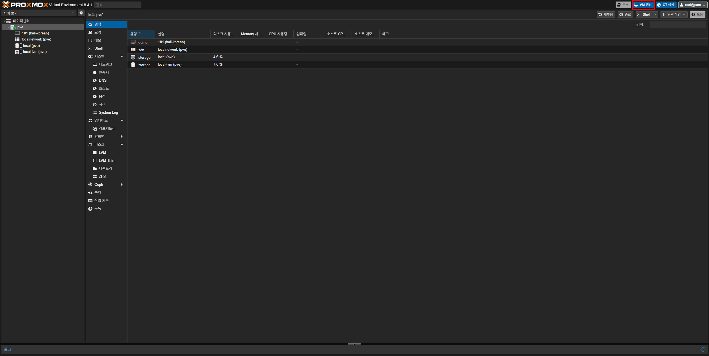

VM을 생성하는 창이 표시되면 원하는 이름을 입력하세요. 원할 경우 **부팅 시 시작**도 같이 선택하세요.

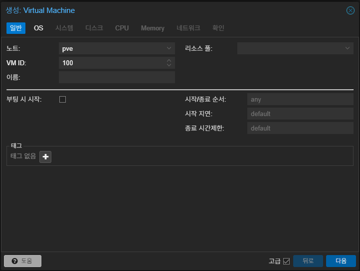

**미디어 사용 안 함**을 누르세요.

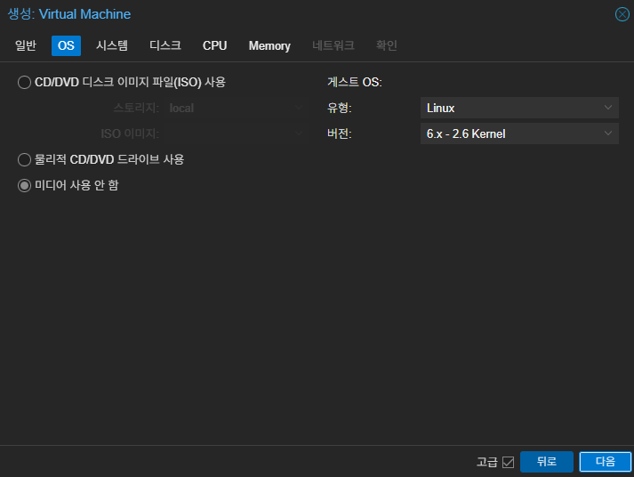

다음과 같이 설정하세요. PCIe 패스스루를 사용하지 않을 예정이라면 머신과 BIOS는 기본값으로 둬도 돼요.

[QEMU 게스트 에이전트](https://pve.proxmox.com/wiki/Qemu-guest-agent)를 사용할 예정이라면 **Qemu 에이전트**를 선택하세요.

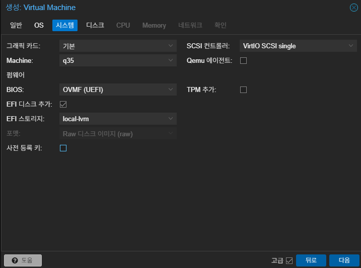

디스크의 경우 두 가지 중 하나를 선택할 수 있어요. 원하는 방법을 선택하세요 (**일부 모델을 제외하고 SCSI는 지원하지 않아요, 반드시 SATA로 선택하세요**):

1. **디스크 패스스루**:
가상 디스크를 추가하지 않고 물리적 디스크를 VM에 넘겨주는 방식이에요. 메인보드 또는 SATA 확장 카드의 컨트롤러를 넘기지 않으면 모델명이 디스크 모델명이 아닌 `QEMU HARDDISK`로 인식돼요.

2. **가상 디스크 추가**:
Proxmox에서 [LVM 또는 LVM-Thin](https://svrforum.com/svr/681451)으로 생성된 디스크를 VM에 할당해주는 방식이에요. 용량이 충분하다면 가장 편한 방법이지만, 추후 마이그레이션이 불가능한 단점이 있어요.

이 가이드에서는 **가상 디스크 추가**방법을 사용할게요. 다음과 같이 설정 후 `디스크 크기 (GiB)`는 최소 16GB 이상의 허용된 용량 내에서 설정하고 다음을 누르세요. (디스크 패스스루의 경우 마지막에 작성되어 있으며 SSD를 사용 중인 경우 `SSD 에뮬레이션`에 체크하면 좀 더 빠른 속도로 사용 가능해요)

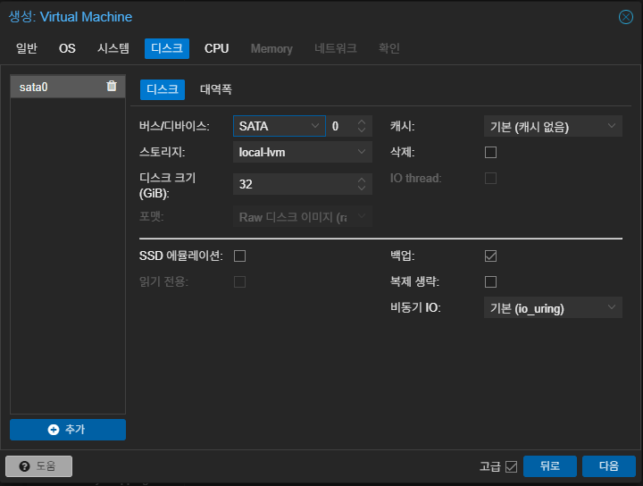

CPU의 경우 다음과 같이 설정하면 돼요. 원활한 작동을 위해 반드시 `최소 4코어`를 할당해줘야 해요.

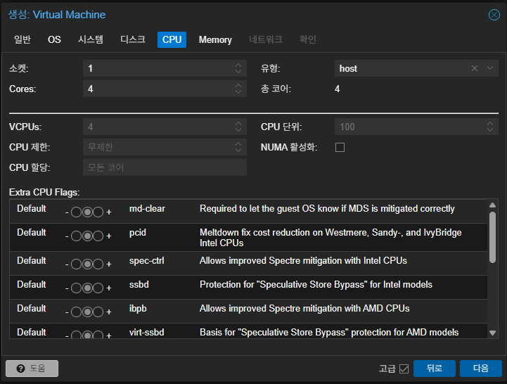

메모리의 경우 `4GB (4096 MiB)` 이상 설정해주면 돼요. 장착된 램의 총 용량 내에서 적절히 설정하세요.

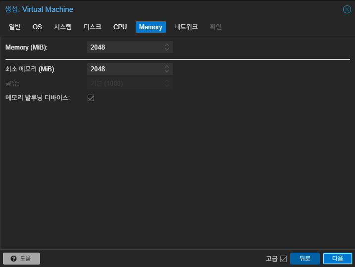

네트워크의 경우 설정할 것이 없으니 넘어가세요.

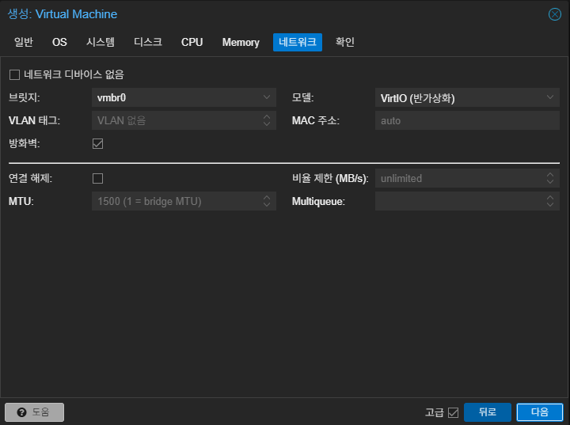

모든 설정을 마치면 다음과 같이 보이게 될 거에요. **마침**을 눌러 생성을 끝내세요.


이제 다시 Proxmox 노드를 선택하고 **Shell**을 누르세요.


다음 명령어를 입력하여 VM의 설정파일을 나노(nano)에디터나 vi 에디터로 여세요. (**VMID 값은 생성한 VM의 ID에요**)

```bash
# nano 에디터의 경우:
nano /etc/pve/qemu-server/VMID.conf

# vi 에디터의 경우:
vi /etc/pve/qemu-server/VMID.conf
```

파일을 열었으면 다음 내용을 `agent: 1(또는 0)` 윗줄에 추가하세요. (`tinycore-redpill.v1.2.3.8.m-shell`의 경우 받은 버전에 맞게 수정해야 해요)

```plaintext
args: -drive 'if=none,id=synoboot,format=raw,file=/var/lib/vz/template/iso/tinycore-redpill.v1.2.3.8.m-shell.img' -device 'qemu-xhci,addr=0x18' -device 'usb-storage,drive=synoboot,bootindex=5'
```

전체 내용은 다음과 같아요:

```plaintext
args: -drive 'if=none,id=synoboot,format=raw,file=/var/lib/vz/template/iso/tinycore-redpill.v1.2.3.8.m-shell.img' -device 'qemu-xhci,addr=0x18' -device 'usb-storage,drive=synoboot,bootindex=5'
agent: 1
bios: ovmf
boot: order=sata0;ide2;net0
cores: 4
cpu: host
efidisk0: local-lvm:vm-100-disk-0,efitype=4m,size=4M

...
```

저장이 완료되었으면 VM을 우클릭 후 **시작**을 눌러 전원을 켜세요.

켜게되면 다음과 같은 화면이 보이게 돼요. 기본값인 **Tiny Core Redpill Image Build**를 누르세요.


아무 키나 눌러 계속 진행하세요. 인터넷 환경에 따라 조금 오래걸릴 수 있어요.


언어를 한국어로 변경할지 물어보는 창이 표시되면 변경을 원할 경우 **y**를 입력하세요.


입력하게 되면 파일을 받아오게 되는데 해외에서 받아오기에 많이 느려요. 잠시 기다리세요.

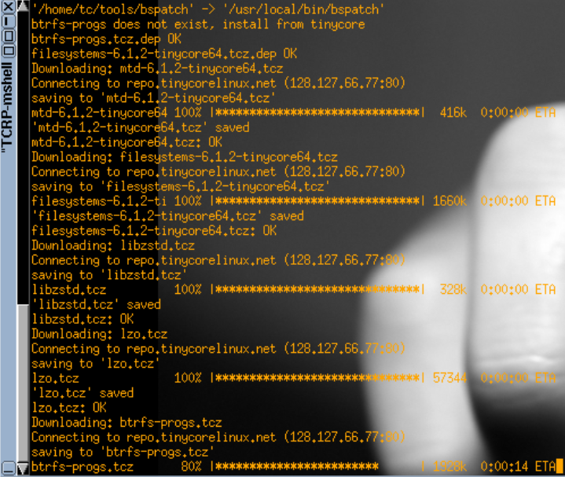

끝나면 다음과 같은 화면이 표시돼요. 기본 선택된 **Synology 모델 선택**을 선택 후 원하는 모델을 선택하세요.

대표적으로 `SA6400, DS3622xs+, DS918+ 등과 같은 모델`을 많이써요. SCSI를 사용할 예정이면 `DS3622xs+`을 선택하세요. (이 가이드에서는 SA6400으로 진행할 예정이지만 방법은 동일해요)

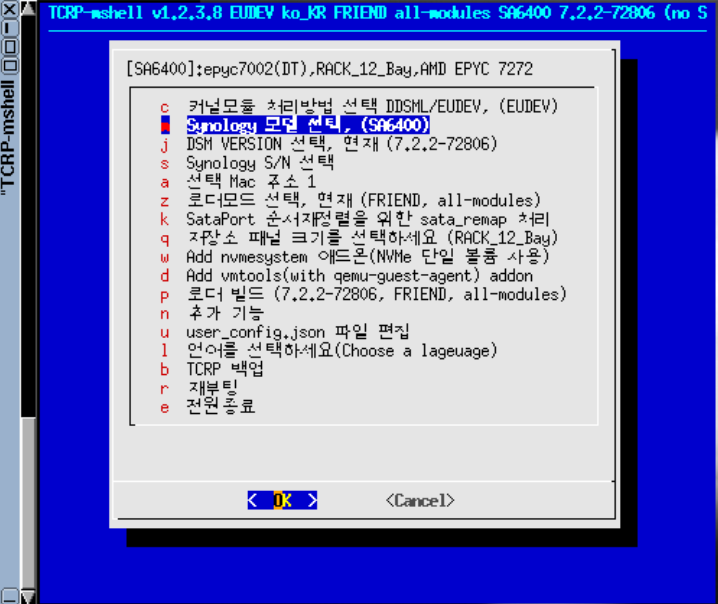

**DSM VERSION 선택**의 경우 기본값으로 최신 버전이 되어있으니 해당 메뉴를 선택하여 최신 버전을 선택하세요.


**Synology S/N 선택**과 **선택 Mac 주소 1**의 경우 보유중이지 않다면 각 메뉴에서 `시놀로지 랜덤 S/N 생성`, `랜덤 MAC 주소 생성`을 누르세요.

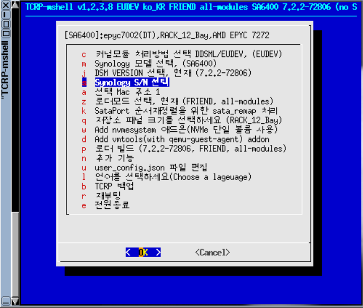
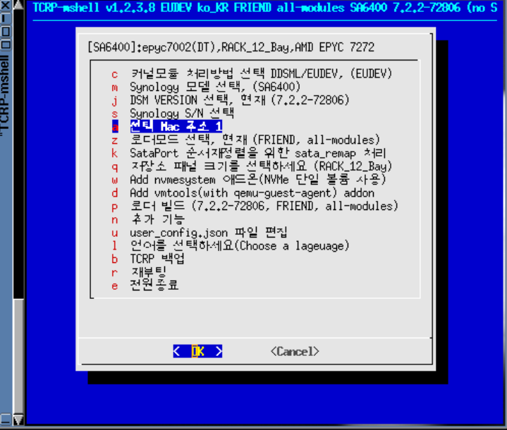

만약 VM 생성 시 `Qemu 에이전트`를 선택하였다면 **Add vmtools addon**을 선택하고 **로더 빌드**를 누르세요 (이 옵션은 선택이지만, Qemu 에이전트를 선택하였다면 체크하는 것이 좋아요)

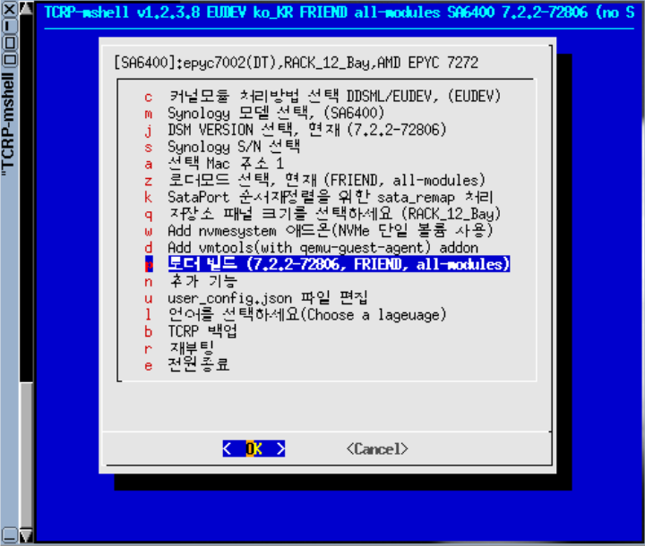

로더 빌드를 누르게 되면 다음과 같이 많은 내용들이 뜨고 진행될 거에요. 끝날 때까지 기다리세요.

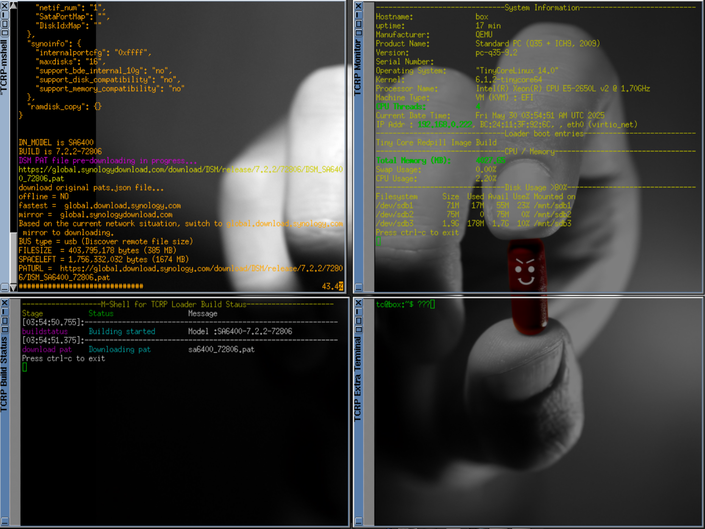

빌드가 끝나게되면 **재부팅**을 눌러 재부팅 후 기다리게 되면 아래 사진처럼 첫 번째 항목으로 자동 부팅될 거에요.


사진과 같이 `IP주소:5000`이 뜨게되면 뜬 시점에서 20~40초 뒤에 웹 브라우저로 해당 주소를 들어가세요.

```plaintext
http://IP주소:5000
```

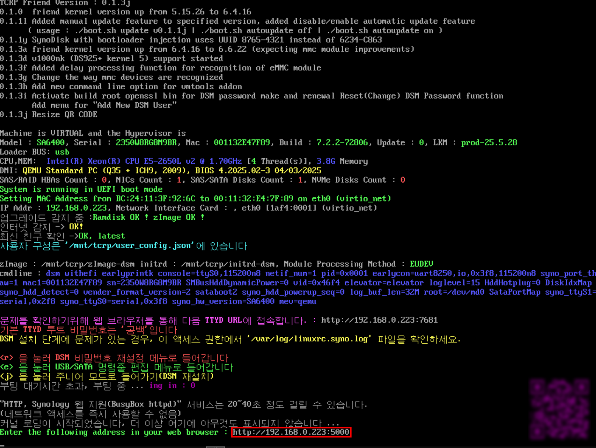

사진과 같은 화면이 뜨게되면 이제 설치하기만 하면 돼요. **설치** 버튼을 누르고 **다음**을 눌러 DSM 설치를 진행하세요.


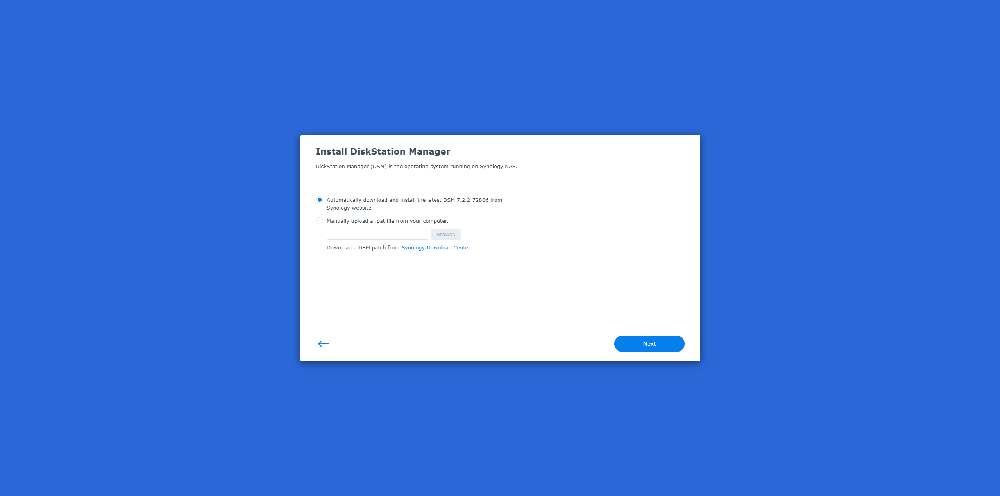

설치 직전에 데이터를 지우기 위해 모델명을 입력하라는 창이 표시되면 **이전에 지정한 모델명(예: SA6400)**을 입력하세요.

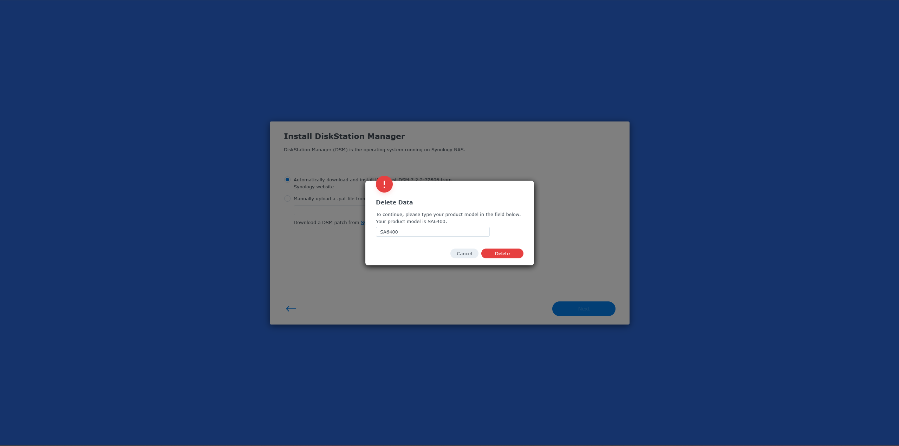

설치가 끝나게되면 10분 후에 준비된다는 내용이 표시돼요. 만약 10분이 지났는데 넘어가지 않고 에러가 뜬다면 `모델이 호환되지 않거나 IP가 변경된 경우` 등에 속해요. IP의 경우 공유기의 관리자페이지에서 할당된 IP를 확인하세요.


기다리면 다음과 같은 화면이 뜨게돼요. **시작**을 눌러 기기 이름과 사용자 계정을 설정하세요. 초기 관리자 비밀번호의 경우 `하나 이상의 대문자`가 들어가야 해요.

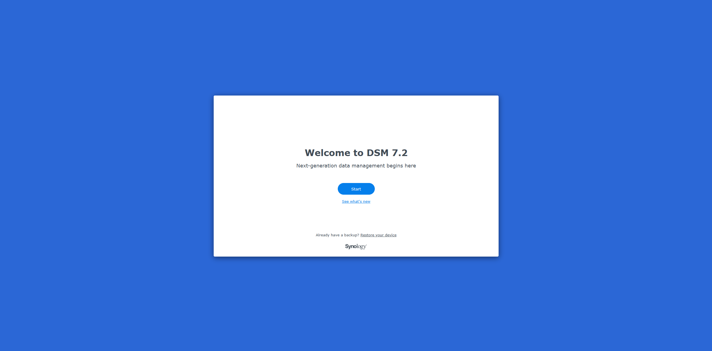

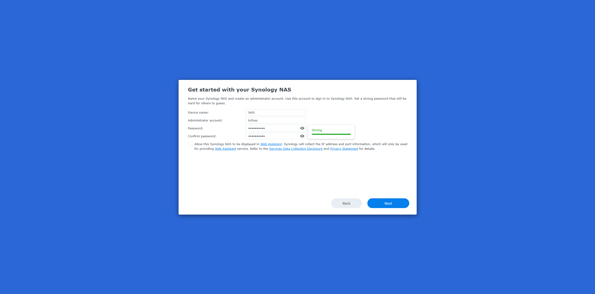

업데이트의 경우 **3번째 항목(DSM 또는 패키지 업데이트가 있을 시 알림)**을 선택하세요. DSM의 버전이 크게 변경되는 경우 문제가 발생할 수 있어요. (예: 7.x -> 8.x)

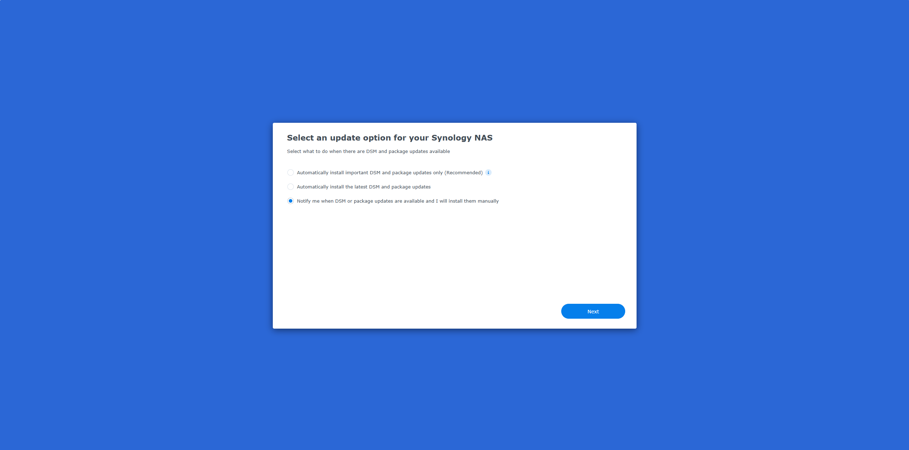

시놀로지 계정, 기기 진단의 경우 건너뛰세요.

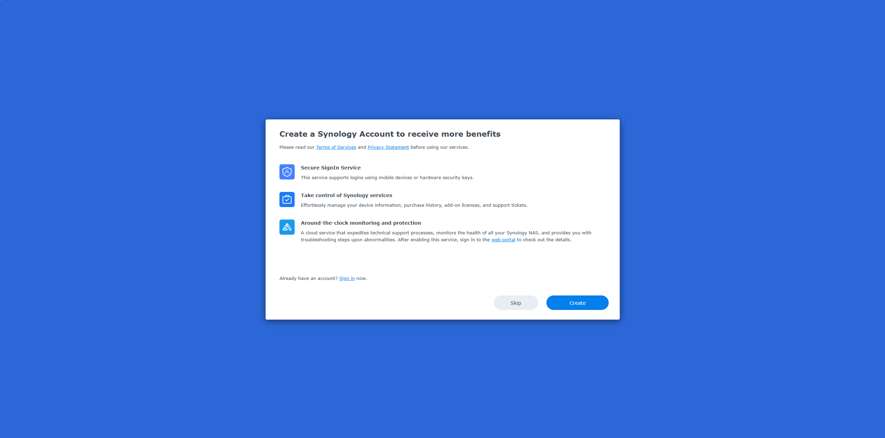

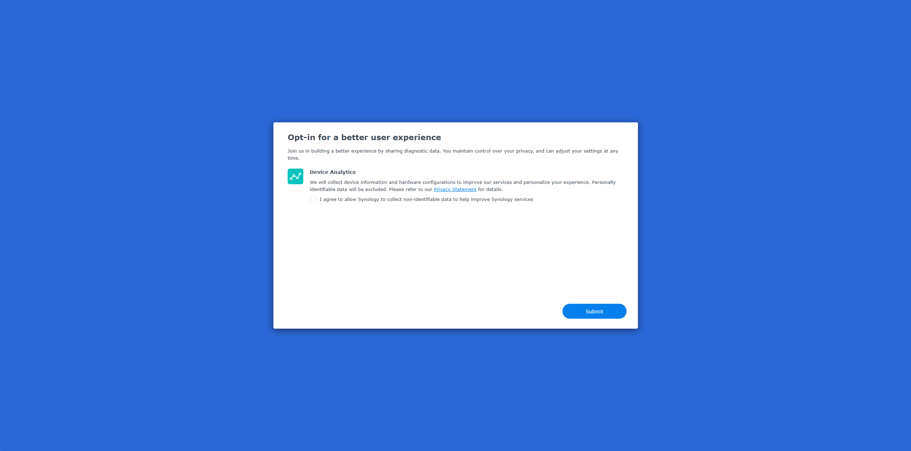

모든 설정이 완료되고 잠시 기다리게 되면 `연결이 비공개로 설정되어 있지 않습니다`라는 창이 표시되는데 **고급 - IP (안전하지 않음)**을 눌러 들어가세요.

들어가게 되면 추가 설정을 하는 항목이 나타나게 되는데, 시놀로지 계정과 연관된 부분이 있으니 가능한 전부 건너뛰세요. 설정을 마치게 되면 `스토리지 풀 만들기`라는 창이 표시돼요.

스토리지 풀까지 만들게 되면 기본적인 구축이 끝났어요.

